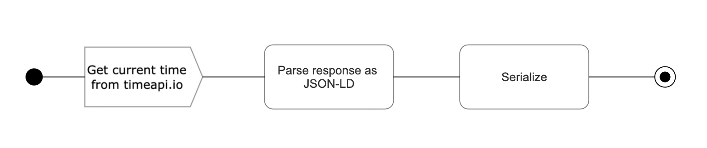

import Tabs from '@theme/Tabs';
import TabItem from '@theme/TabItem';
import CodeBlock from '@theme/CodeBlock';
import { selectLines } from '@site/src/lines.js'
import pipeline from '!!raw-loader!./first-pipeline.ttl'

# Getting started

In this tutorial we will create a simple pipeline which fetches the current time from a Web API at
`timeapi.io`, interprets it as RDF treating the response as JSON-LD, and finally serializes as n-triples.



## Setting up the project

:::tip

If you are not fluent with Node.js & NPM read more about how to [create a package.json](https://docs.npmjs.com/creating-a-package-json-file) file.

:::

First, install the main barnard59 package which serves a CLI to run pipelines. We will use it later in this tutorial.

<Tabs>
  <TabItem value="npm" label="NPM" default>

    npm init -y
    npm i --save barnard59

  </TabItem>
  <TabItem value="yarn" label="Yarn">

    yarn init -y
    yarn add barnard59

  </TabItem>
</Tabs>

Add `type: module` to the package.json to use ESM Modules

```diff
{
  "name": "barnard59-time-zone",
  "version": "1.0.0",
+ "type": "module",
  "description": "",
  "main": "index.js",
  "scripts": {
    "test": "echo \"Error: no test specified\" && exit 1"
  },
  "keywords": [],
  "author": "",
  "license": "ISC"
}
```

Then, add necessary dependencies which provide the operations we will use in the pipeline:

<Tabs>
  <TabItem value="npm" label="NPM" default>

    npm i --save barnard59-formats barnard59-http barnard59-base

  </TabItem>
  <TabItem value="yarn" label="Yarn">

    yarn add barnard59-formats barnard59-http barnard59-base

  </TabItem>
</Tabs>


## Pipeline definition

Create a file `pipeline/main.ttl`. It will contain the turtle definition of the pipeline and its steps. The `barnard59`
CLI then parses this file and executes the processing.

First, add the necessary prefixes and a base URI.

<CodeBlock language="turtle" title="pipeline/main.ttl">
  {selectLines(pipeline, { to: 3 })}
</CodeBlock>

Then add the pipeline resource itself.

<CodeBlock language="turtle" title="pipeline/main.ttl">
  {selectLines(pipeline, { from: 5, to: 18 })}
</CodeBlock>

Here, you started a [`Readable`](/docs/workflows/explanations/pipeline) pipeline with 5 steps and a variable which
will be needed by those steps and is the means to parametrise a pipeline.

### Fetch time from API

Next, add implementation of `<fetch>` step to retrieve the current time using a simple HTTP request.

<CodeBlock language="turtle" title="pipeline/main.ttl">
  {selectLines(pipeline, { from: 20, to: 30 })}
</CodeBlock>

### Parse time as JSON-LD

The `timeapi.io` returns a plain JSON response which represents a point in time. That response will be similar to:

```json
{
  "year": 2023,
  "month": 7,
  "day": 27,
  "hour": 10,
  "minute": 44,
  "seconds": 23,
  "milliSeconds": 88,
  "dateTime": "2023-07-27T10:44:23.0884467",
  "date": "07/27/2023",
  "time": "10:44",
  "timeZone": "UTC",
  "dayOfWeek": "Thursday",
  "dstActive": false
}
```

This JSON will be pushed as a single string [chunk](https://nodesource.com/blog/understanding-streams-in-nodejs/).
To convert it to RDF, first parse the JSON itself by using an operation from `barnard59-base`:

<CodeBlock language="turtle" title="pipeline/main.ttl">
  {selectLines(pipeline, { from: 32, to: 37 })}
</CodeBlock>

:::info
[`barnard59-base`](https://github.com/zazuko/barnard59/blob/master/packages/base/manifest.ttl) contains many steps which
will be useful in stream processing, such as filtering chunks, merging multiple stream, or parsing JSON seen above.
:::

Next, you'll want to apply a JSON-LD context to extract the `dateTime` from the JSON and have it parsed as an
`xsd:dateTime` literal.

<CodeBlock language="turtle" title="pipeline/main.ttl">
  {selectLines(pipeline, { from: 39, to: 54 })}
</CodeBlock>

When processing a stream, a chunk can be modified by mapping to a new value. Here, the argument to the `map.js` module
is a function which should return JSON-LD. As seen in the previous snippet, the implementation is `addContext` function
exported from a module `lib/jsonldStructure.js`

```js title="lib/jsonldStructure.js"
export function addContext(json) {
    const TZ = this.variables.get('TZ')

    return {
        '@context': {
            dateTime: 'http://purl.org/dc/elements/1.1/date'
        },
        '@id': `https://timeapi.io/api/Time/current/zone?timeZone=${TZ}`,
        ...json
    }
}
```

Finally, the parsing itself is a dedicated operation provided by the package `barnard59-formats`:

<CodeBlock language="turtle" title="pipeline/main.ttl">
  {selectLines(pipeline, { from: 56, num: 5 })}
</CodeBlock>

:::caution
Notice the `#parse.object` export used to parse JSON-LD which is used with object chunks. When processing a raw, string
JSON-LD stream `#parse` would be used instead.
:::

### Serialize

Finally, to serialize an RDF stream, simply add the last, simple step.

<CodeBlock language="turtle" title="pipeline/main.ttl">
  {selectLines(pipeline, { from: 63, num: 6 })}
</CodeBlock>

## Running the pipeline

You are now ready to run the pipeline:

```
npx barnard59 run pipeline/main.ttl --pipeline http://example.org/pipeline/tz
```

The CLI `run` action is called the path of the pipeline's source and its identifier.

In the output, you should see a single triple

```turtle
<https://timeapi.io/api/Time/current/zone?timeZone=UTC>
  <http://purl.org/dc/elements/1.1/date>
    "2023-07-31T08:02:55.8602811" .
```

### Substituting variables

To use a different timezone, you can provide an override for the variable declared in the pipeline definition from the
command line.

```
npx barnard59 run pipeline/main.ttl \
  --pipeline http://example.org/pipeline/tz \
  --variable TZ=America/New_York
```

The output would be adjusted accordingly

```turtle
<https://timeapi.io/api/Time/current/zone?timeZone=America/New_York>
  <http://purl.org/dc/elements/1.1/date>
    "2023-07-31T04:02:55.8602811" .
```
